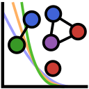

# EDDP.jl

An alternative [Julia](https://julialang.org/) implementation of the ephemeral data derived potentials ([EDDPs](https://journals.aps.org/prb/abstract/10.1103/PhysRevB.106.014102)).

## Features

- Fitting and evaluation of the potentials.
- Structure prediction, working with the AIRSS packages. 

## Todo

* [x] Workflow system for easy construction of the potentials
* [x] Validation of the boron system
* Compiler friendly types - can using Vector instead of Tuple a better choice? 
  * [ ] For Ensemble interface
  * [ ] For features?
  * [ ] For qs and qs?
* [ ] Documentations
* [ ] Change the dispatch signature of two-body/three-body - there is no need to use type dispatch here. So we can lift the need of the input begin a Vector (e.g. using Tuple instead). This allow mix/match of features with different f(r)
* [ ] Generalise Neutral network interfaces so different NN implementations can be used interchangeably
* [ ] Benchmark against the Fortran [EDDP](https://www.mtg.msm.cam.ac.uk/Codes/EDDP) package

## Scaling the feature vectors

Scaling is performed for neuron networks, for linear fits this is not needed.
In all cases, the one-body vectors should not be scaled as they are one-hot encoders.

## Improve manual backprop 

Allow any input batch size to be used.
Current we are limited to using only the size that it defined. Can we add another layer and dispatch based on the sizes of the inputs? This would make it much more convenient and avoid allocations?

## Training workflow

1. Generate the initial set of random structures and compute DFT singlepoint energies
2. Train (ensemble) model#1
3. Generate more (M) random structures and relax them using model#1
4. Shake the relaxed structures N times, giving M(N+1) new structures
5. Compute the DFT singlepoint energies of the new structures
6. Train (ensemble) model#2 using the new set of structures 
7. Repeat 3-6 to get about 5 iterations

### Tips

* The random structure generation process must cover a random of volume to sample an diverse configuration space.
* The distribution of volumes needs to be monitored in the subsequent relaxation
* Improvement of the models (convergence) may be tracked by the out-of-sample RMSE, e.g. using model#A-1 for new structures in iteration #A.